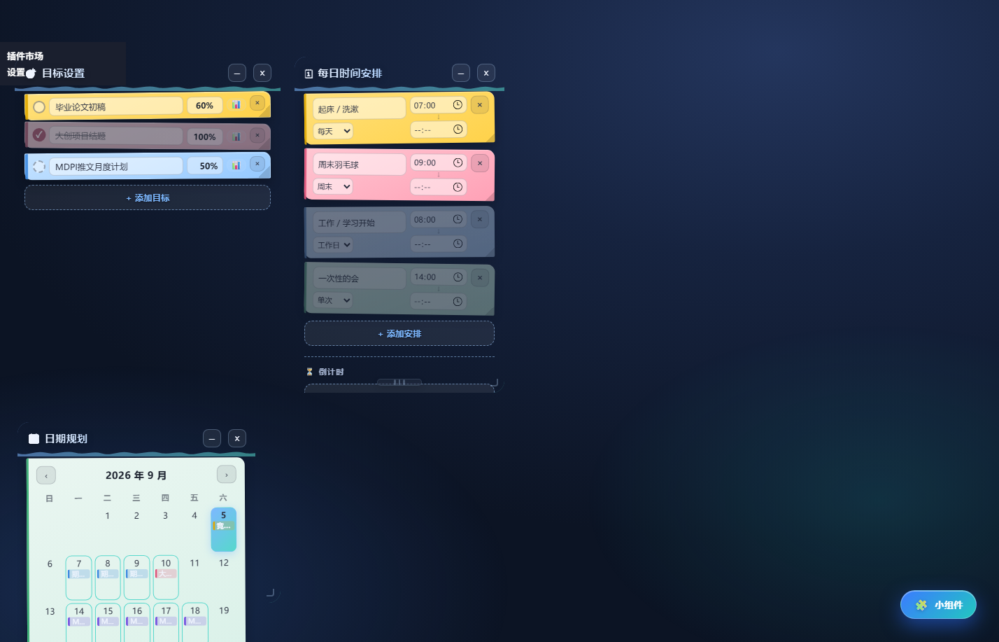

<div align="center">



# 🗓️ schedule

**DSH Desktop 桌面小组件 · 三合一悬浮卡片**

_时间安排 · 目标追踪 · 日期规划 —— 一个插件，铺满你的桌面_


</div>

---

> 纯前端 vanilla DOM 实现，**零依赖**，localStorage 持久化。
> 三张卡片均可拖动、任意缩放、自动记忆位置，明暗主题自动跟随桌面壁纸。

> **English**: A pure vanilla-DOM DSH Desktop widget suite with **zero dependencies**. Three draggable, resizable, position-remembering floating cards — daily schedule, goal tracker with freeform flowchart workspace, and calendar planner — all persisted via localStorage and auto-adapting between light/dark themes.

## ✨ 三个模块

| 模块 | 一句话介绍 |
| --- | --- |
| 🗓 **每日时间安排** | 写一次长期生效的日程：事项 + 起止时间 + 周期（每天 / 工作日 / 周末） |
| 🎯 **目标设置** | 一行一个目标的条状数据行，进度直接点数字改；📊 展开自由流程图工作台 |
| 📆 **日期规划** | 月历视图的跨天任务：从某天到某天，彩色任务条铺满每一天 |

### 🗓 每日时间安排

- 每行布局：**事项（左）· 起止时间段（右，上下堆叠）· 周期下拉 · 删除**
- **周期**：每天 / 工作日 / 周末 —— 写一次长期生效，当天不生效的行半透明显示
- 首次使用自动注入一日模板；旧版本数据自动迁移
- 内置倒计时便签（重要日期倒数：天 + 时 : 分 : 秒）

### 🎯 目标设置

- 条状数据行 `[勾选] [名称] [进度%] [📊] [×]` —— 在最小的空间显示最多的数据
- 进度百分比**点击即可编辑**（0–100）；含子目标的目标自动汇总为百分比（只读）
- 点 📊 展开 **WPS 工作台式自由流程图**：
  29 种 SVG 形状 · 正交吸附连线 · 节点截止日期条（按紧迫度变色）· 画布 0.3×–2.5× 缩放

### 📆 日期规划

- 任务为 `{标题, 开始日期, 结束日期, 颜色}` 的**跨天任务**
- 跨多天的任务在覆盖的每一天格子里显示彩色任务条（最多 3 条 + `+N`）
- 点击某天新建任务；编辑器含起止日期（自动纠正倒置）与 6 色色板

### 🧩 通用特性

- 卡片拖动 + 位置记忆，双方式缩放（右下角 + 底部把手），便签装饰随卡片等比缩放
- 悬浮 🧩 按钮一键显隐全部卡片
- 所有数据存 localStorage，刷新 / 重启不丢

## 📦 安装

### 方式一：从 tgz 安装（推荐）

从 [Releases](https://github.com/Nicercz007-cloud/schedule/releases) 下载 `schedule-x.y.z.tgz` 后：

```bash
dsh plugin add ./schedule-0.16.7.tgz
```

或者手动解压到 DSH 的插件目录：

```bash
# 1. 源目录
unzip schedule-0.16.7.tgz -d /tmp && cp -r /tmp/package ~/.dsh/local-plugins/schedule
# 2. 运行目录（重要 —— DSH Desktop 实际从 profiles/desktop 加载）
cp -r /tmp/package ~/.dsh/profiles/desktop/node_modules/schedule
```

### 方式二：从源码

```bash
git clone https://github.com/Nicercz007-cloud/schedule.git
mkdir -p ~/.dsh/local-plugins ~/.dsh/profiles/desktop/node_modules
cp -r schedule ~/.dsh/local-plugins/
cp -r schedule ~/.dsh/profiles/desktop/node_modules/
```

> 💡 两条 `cp` 缺一不可：`local-plugins` 是插件注册目录，`profiles/desktop/node_modules` 是 DSH Desktop 实际加载的运行副本。
> 💡 Windows 用户请用 **Git Bash** 执行上述命令（`~` 即 `C:\Users\<你>`）；或者直接用资源管理器把 `schedule` 文件夹分别复制进这两个目录。
> ⚠️ 安装后请**完全重启 DSH Desktop** 生效。

## 🗂 项目结构

```text
lib/client.js      浏览器半：全部 UI（三张卡片 + 流程图），注入页面运行
lib/index.js       宿主半：cordis bundle 注册（安全 no-op）
cordis.patch.yml   bundle 注册补丁
docs/              截图
```

## 🔑 数据键（localStorage）

| 键 | 内容 |
| --- | --- |
| `dw:schedule:data` | 每日时间安排 `[{id, time, endTime, text, kind}]` |
| `dw:countdown:data` | 倒计时便签 |
| `dw:goals:data` | 目标（含子目标树 + 流程图） |
| `dw:cal:data` | 日期规划 `[{id, title, desc, startDate, endDate, color}]` |

## 📜 更新日志

| 版本 | 变更 |
| --- | --- |
| **0.16.7** | 流程图新增「缩小停靠」：⇥/←/Esc 后项目树大纲挂在目标卡片右侧（点击展开，× 移除，重启保留）；修复旧目标无 id 导致流程图状态持久化静默失效（数据自愈） |
| 0.16.6 | 移除内嵌第三方壁纸（base64）并修复体积/版权问题；去掉未实现的「单次」周期选项；安装命令改用 `dsh plugin add` |
| 0.16.5 | 目标进度统一为百分比显示 |
| 0.16.4 | 目标卡片改为条状数据行、整体缩小；修复事项与时间段重叠 |
| 0.16.3 | 目标卡片竖排网格；修复重叠（`box-sizing:border-box`） |
| 0.16.2 | 目标进度改为方块式分段显示 |
| 0.16.1 | 每日安排改为事项在左、时间在右 |
| 0.16.0 | 周期下拉、日历跨天任务、装饰随卡片缩放 |

## 📄 License

[MIT](LICENSE) © 2026
